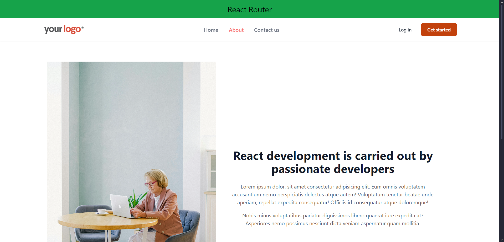

# React Router App

This is a React application that demonstrates routing using `react-router-dom`. The project includes a layout with a header, footer, and navigational routes to different pages such as Home, About, and Contact.

## Features

- **React Router** for seamless navigation between pages.
- **Responsive Layout** with a sticky header and responsive design.
- **Tailwind CSS** for styling components.
- Includes `NavLink` for active link styling.
- Modular component structure for easy scalability.

## Components

### Main Components
- **App**: Root component that initializes routing.
- **Layout**: Contains the shared structure including Header, Footer, and a placeholder for routed components via `Outlet`.

### Page Components
- **Home**: Displays the main content.
- **About**: Provides information about the application.
- **Contact**: A simple contact page.

### Other Components
- **Header**: Includes navigation links to different routes.
- **Footer**: A footer component displayed on every page.


## Installation and Setup
1. **Clone the repository:**
   ```bash
   git clone https://github.com/chriswilder3/React-ClietSide-Website-Router-App.git
   cd React-ClietSide-Website-Router-App
   ```
2. **Install dependencies:**

   ```bash
   npm install
   ```

3. **Start the development server:**

   ```bash
   npm start
   ```

4. Open your browser and navigate to http://localhost:3000.

## Preview



